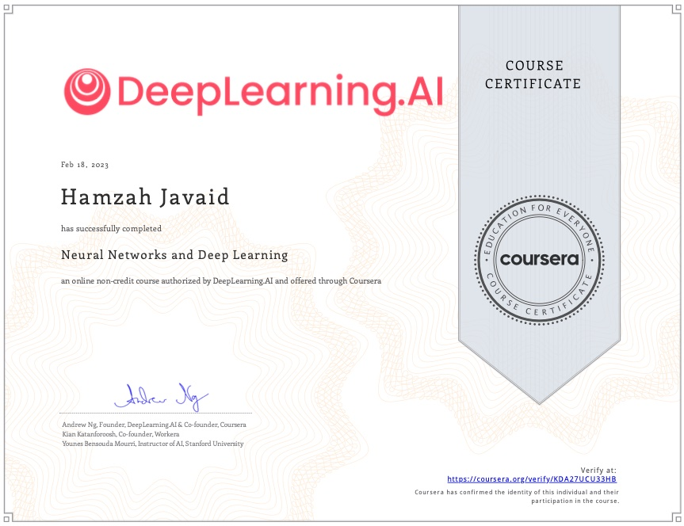

### Neural Networks and Deep Learning
---

I succesfully completed a DeepLearning.ai course entilted: Neural Networks and Deep Learning

https://www.coursera.org/account/accomplishments/verify/KDA27UCU33HB
