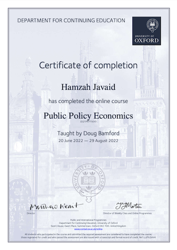

### Public Policy Economics
---

I officially spent 200 hours, and plenty more unofficial hours, to submit multiple assignments and study for Oxford University's, Department of Continuing Studies
'Public Policy Economics' course.
